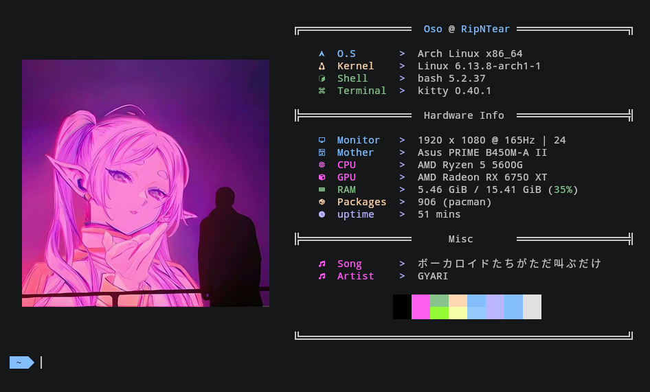

# 🖌️ Baddies in Terminal

A simple repository for compiling terminal color schemes (Base16), ready to be applied.

🖥️ Supported terminals:
- 🐱 Kitty
- 🚀 Alacritty
- 🐜 Termite
- X  XResources
- 📱 Termux
- 🪟 Windows Terminal
- 🐧 Linux TTY

## 📄 List of Themes

You can see the list of ALL themes at: [THEMES](./THEMES.md)
