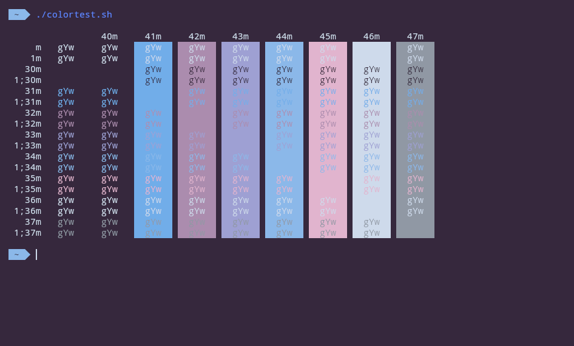
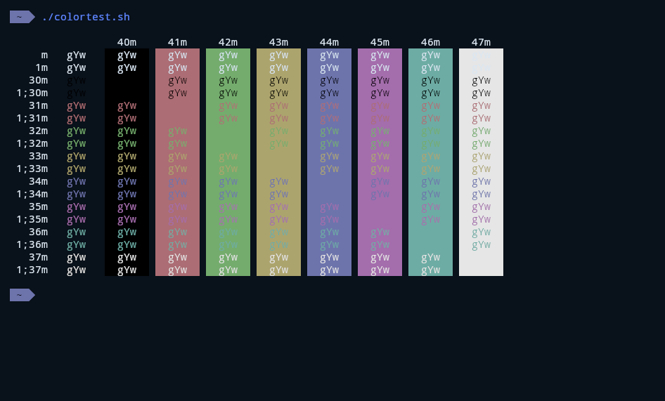

# List of Themes

A small demonstration of the themes here:

<a href="./Themes/Atom/credits.md">Atom</a>

fetch :  

colortest :  

<a href="./Themes/Aura/credits.md">Aura</a>

fetch :  

colortest :  

<a href="./Themes/Ayaka/credits.md">Ayaka</a>

fetch :  

colortest :  

<a href="./Themes/Azu/credits.md">Azu</a>

fetch :  

colortest :  

<a href="./Themes/Base2Tone-Cave-Dark/credits.md">Base2Tone-Cave-Dark</a>

fetch :  

colortest :  

