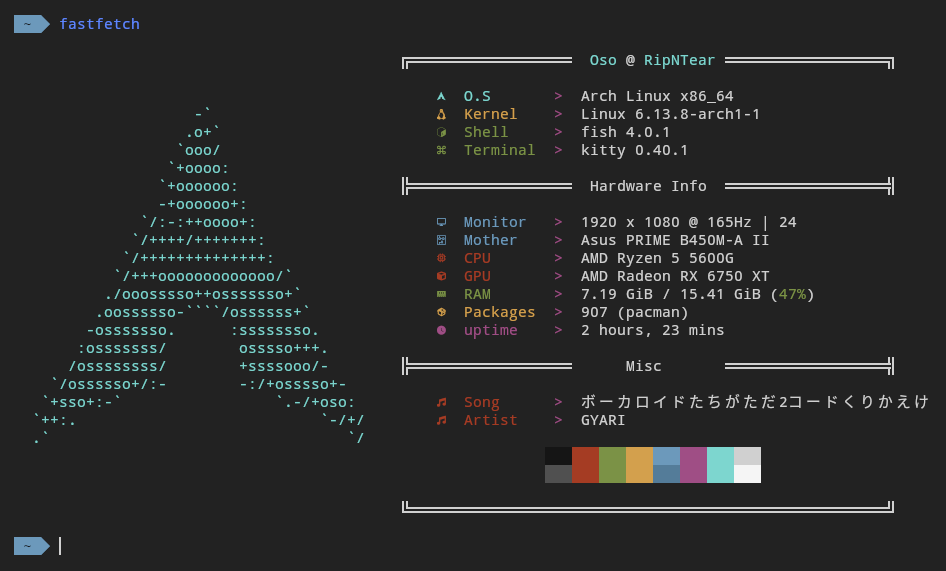
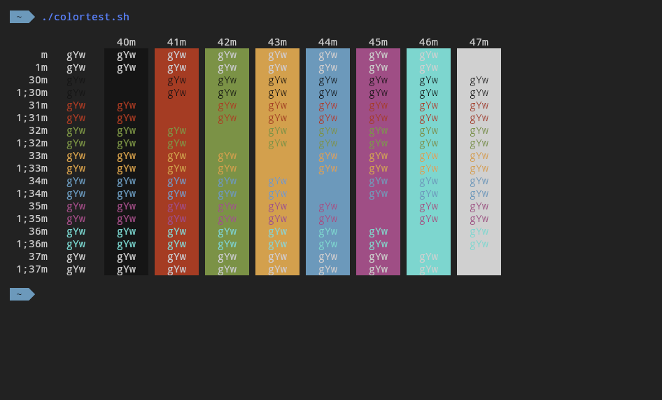

# Afterglow

### Links :
- 📃 Web Page : [GitHub Repo](https://yabatadesign.github.io/afterglow-theme/)
- 📃 Original Yaml : [GitHub file](https://github.com/Gogh-Co/Gogh/blob/master/themes/Afterglow.yml)
- 🐱 Kitty port credits : [Oso](github.com/KernelOso), using [yaml to Terminal Config](https://github.com/KernelOso/YAML_color-scheme_to_Terminal_Themes)
- 🚀 Alacritty port credits : [Oso](github.com/KernelOso), using [yaml to Terminal Config](https://github.com/KernelOso/YAML_color-scheme_to_Terminal_Themes)
- 🐜 Termite port credits : [Oso](github.com/KernelOso), using [yaml to Terminal Config](https://github.com/KernelOso/yaml-to-kitty-color-converter)
- 𝕏 XResources port credits : [Oso](github.com/KernelOso), using [yaml to Terminal Config](https://github.com/KernelOso/yaml-to-alacrity-color-converter)
- 📱 Termux port credits : [Oso](github.com/KernelOso), using [yaml to Terminal Config](https://github.com/KernelOso/yaml-to-kitty-color-converter)
- 🪟 Windows Terminal port credits : [Oso](github.com/KernelOso), using [yaml to Terminal Config](https://github.com/KernelOso/yaml-to-alacrity-color-converter)

fetch :  

colortest :  
