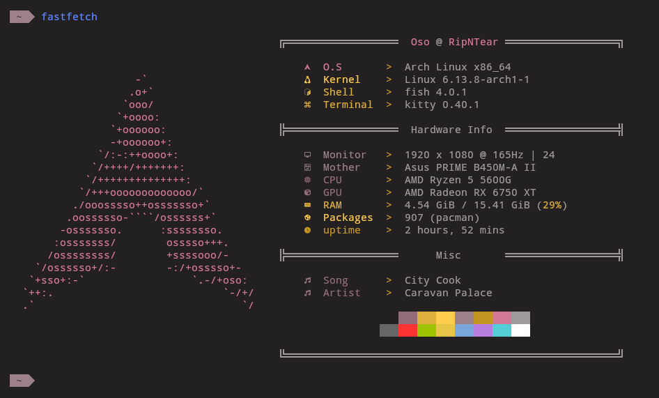
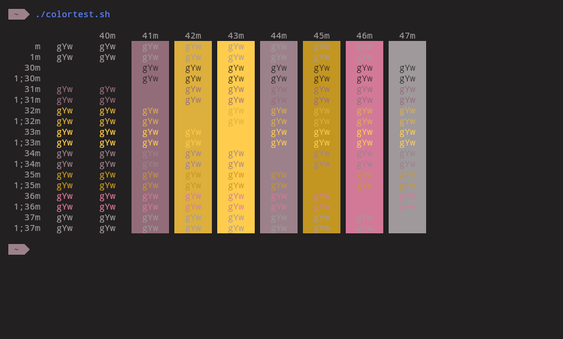

# Base2Tone - Cave - Dark

### Links :
- 📃 Web Page : [GitHub repo](https://github.com/atelierbram/Base2Tone)
- 📃 Original Yaml : [GitHub file](https://github.com/atelierbram/Base2Tone-alacritty/blob/master/config/alacritty-base2tone-cave-dark.yml)
- 🐱 Kitty port credits : [Oso](github.com/KernelOso), using [yaml to Terminal Config](https://github.com/KernelOso/YAML_color-scheme_to_Terminal_Themes)
- 🚀 Alacritty port credits : [Oso](github.com/KernelOso), using [yaml to Terminal Config](https://github.com/KernelOso/YAML_color-scheme_to_Terminal_Themes)
- 🐜 Termite port credits : [Oso](github.com/KernelOso), using [yaml to kitty script](https://github.com/KernelOso/yaml-to-kitty-color-converter)
- 𝕏 XResources port credits : [Oso](github.com/KernelOso), using [yaml to kitty script](https://github.com/KernelOso/yaml-to-alacrity-color-converter)

fetch :  

colortest :  
