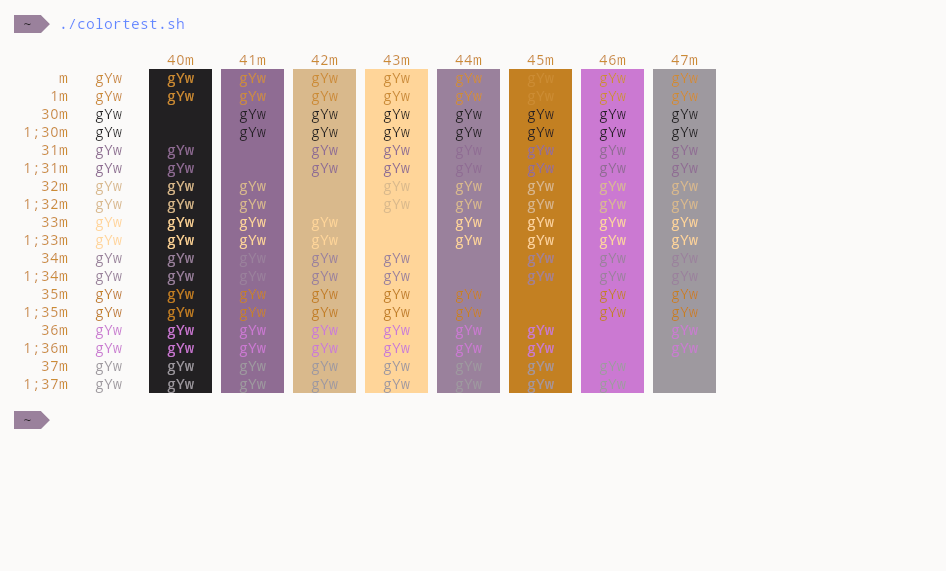

# Base2Tone - Heath - Light

### Links :
- 📃 Web Page : [GitHub repo](https://github.com/atelierbram/Base2Tone)
- 📃 Original Yaml : [GitHub file](https://github.com/atelierbram/Base2Tone-alacritty/blob/master/config/alacritty-base2tone-heath-light.yml)
- 🐱 Kitty port credits : [Oso](github.com/KernelOso), using [yaml to Terminal Config](https://github.com/KernelOso/YAML_color-scheme_to_Terminal_Themes)
- 🚀 Alacritty port credits : [Oso](github.com/KernelOso), using [yaml to Terminal Config](https://github.com/KernelOso/YAML_color-scheme_to_Terminal_Themes)

fetch :  

colortest :  
