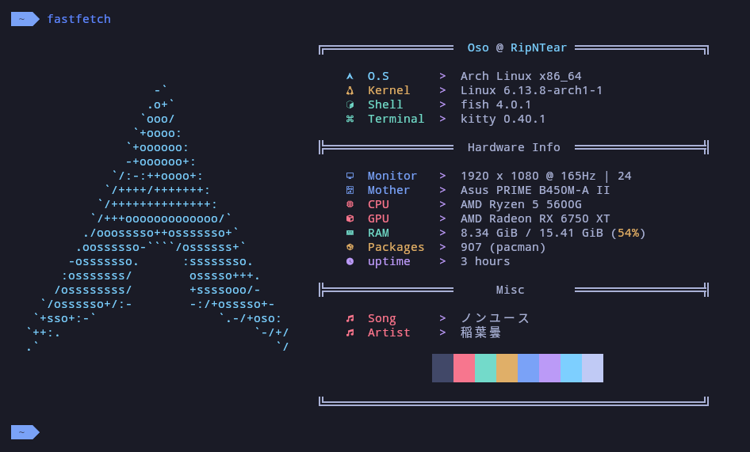
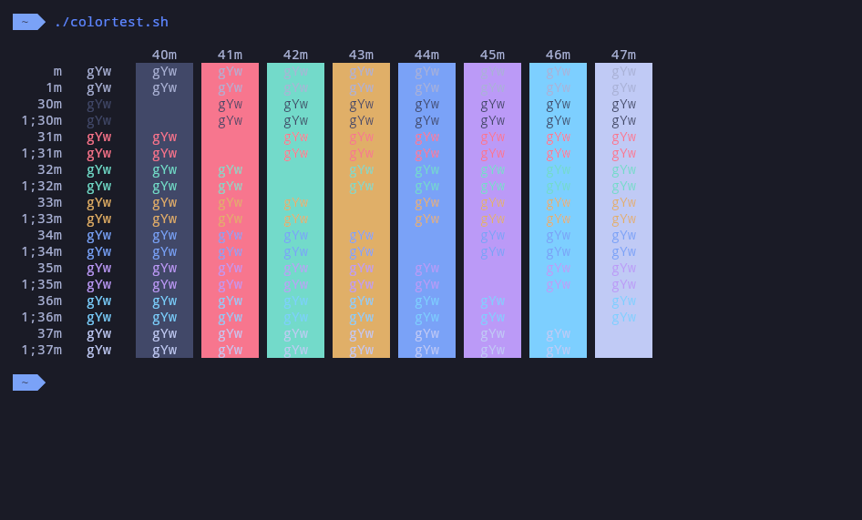

# Tokyo-Night

### Links :
- 🐱 Kitty port credits : [GitHub Repo](https://github.com/davidmathers/tokyo-night-kitty-theme)
- 🚀 Alacritty port credits : [GitHub Repo](https://github.com/zatchheems/tokyo-night-alacritty-theme)
- 🐜 Termite port credits : [Oso](github.com/KernelOso), using [yaml to Terminal Config](https://github.com/KernelOso/yaml-to-kitty-color-converter)
- 𝕏 XResources port credits : [Oso](github.com/KernelOso), using [yaml to Terminal Config](https://github.com/KernelOso/yaml-to-alacrity-color-converter)
- 📱 Termux port credits : [Oso](github.com/KernelOso), using [yaml to Terminal Config](https://github.com/KernelOso/yaml-to-kitty-color-converter)
- 🪟 Windows Terminal port credits : [Oso](github.com/KernelOso), using [yaml to Terminal Config](https://github.com/KernelOso/yaml-to-alacrity-color-converter)
- 🐧 Linux TTY port credtis : [Oso](github.com/KernelOso), using [yaml to Terminal Config](https://github.com/KernelOso/yaml-to-alacrity-color-converter)

fetch :  

colortest :  
